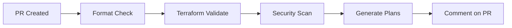
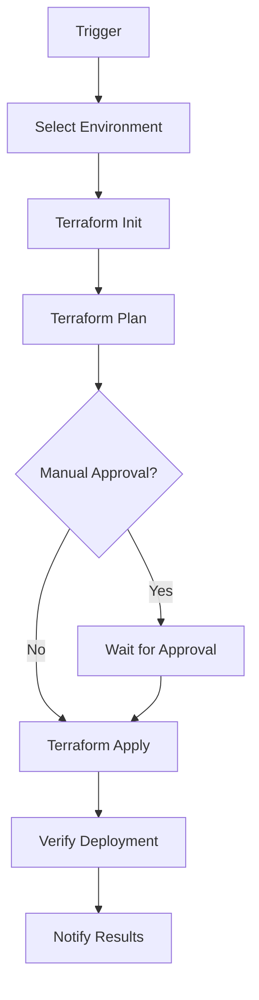

# Terraform CI/CD Pipeline

This repository includes a comprehensive CI/CD pipeline for Terraform infrastructure management using GitHub Actions.

##  Overview

The CI/CD pipeline provides:

- ✅ **Automated Validation** - Format checking, validation, and security scanning on every PR
- ✅ **Multi-Environment Support** - Isolated deployments for dev, staging, perf, and prod
- ✅ **Infrastructure Drift Detection** - Daily automated checks for configuration drift
- ✅ **Secure Authentication** - AWS OIDC integration (no long-lived credentials)
- ✅ **Comprehensive Notifications** - Slack alerts and GitHub status updates
- ✅ **Controlled Destruction** - Safe infrastructure teardown with strict confirmation

##  Quick Start

### 1. Initial Setup

Follow the detailed setup guide: [TERRAFORM_CICD_SETUP.md](../../docs/TERRAFORM_CICD_SETUP.md)

### 2. Required Configuration

**GitHub Secrets** (Settings → Secrets and variables → Actions):
```bash
AWS_ROLE_ARN_DEV=arn:aws:iam::ACCOUNT_ID:role/terraform-dev
AWS_ROLE_ARN_STAGING=arn:aws:iam::ACCOUNT_ID:role/terraform-staging
AWS_ROLE_ARN_PERF=arn:aws:iam::ACCOUNT_ID:role/terraform-perf
AWS_ROLE_ARN_PROD=arn:aws:iam::ACCOUNT_ID:role/terraform-prod
SLACK_WEBHOOK_URL=https://hooks.slack.com/services/YOUR/WEBHOOK/URL
```

**GitHub Environments** (Settings → Environments):
- `dev` - No protection rules
- `staging` - 1 required reviewer
- `perf` - 1 required reviewer
- `prod` - 2 required reviewers, 5-minute wait timer
- `<env>-destroy` - 2 required reviewers for all environments

### 3. Branch Protection

Enable branch protection on `main`/`master`:
- Require PR reviews (1-2 approvals)
- Require status checks to pass
- Require Code Owners review

##  Workflow Structure

### Pull Request Validation (`terraform-pr.yml`)

Triggered on PR creation/update:



**Jobs**:
- `terraform-validate` - Format, validate, security scan
- `terraform-plan-dev` - Generate dev environment plan
- `terraform-plan-staging` - Generate staging environment plan
- `terraform-plan-prod` - Generate production environment plan

### Deployment (`terraform-apply.yml`)

Triggered on merge to main or manual dispatch:



**Features**:
- Environment-specific IAM roles via OIDC
- Automatic change detection (skip if no changes)
- Post-deployment verification
- Slack notifications

### Controlled Destruction (`terraform-destroy.yml`)

Triggered manually with strict confirmation:

**Safety Features**:
- Exact text confirmation required ("destroy")
- Separate destroy environments with enhanced protection
- Extended wait timers for production
- Comprehensive audit logging

### Drift Detection (`terraform-drift-detect.yml`)

Scheduled daily at 2 AM UTC or manual trigger:

**Capabilities**:
- Multi-environment parallel scanning
- Automatic GitHub issue creation on drift
- Slack notifications
- Detailed drift reports

## 🔒 Security Features

### AWS OIDC Integration

No long-lived AWS credentials stored in GitHub:

```yaml
- uses: aws-actions/configure-aws-credentials@v4
  with:
    role-to-assume: ${{ secrets.AWS_ROLE_ARN_PROD }}
    aws-region: us-east-1
```

### IAM Role Trust Policy Example

```json
{
  "Version": "2012-10-17",
  "Statement": [
    {
      "Effect": "Allow",
      "Principal": {
        "Federated": "arn:aws:iam::ACCOUNT_ID:oidc-provider/token.actions.githubusercontent.com"
      },
      "Action": "sts:AssumeRoleWithWebIdentity",
      "Condition": {
        "StringEquals": {
          "token.actions.githubusercontent.com:sub": "repo:OWNER/REPO:environment:prod"
        }
      }
    }
  ]
}
```

### Security Scanning

Integrated `tfsec` for static analysis:
- Checks for misconfigurations
- Identifies security risks
- Generates SARIF reports for GitHub Security tab

##  Code Ownership

Defined in `.github/CODEOWNERS`:

- `tf/` - @infrastructure-team, @terraform-admins
- `tf/envs/terraform_prod.tfvars` - @prod-team, @infrastructure-lead
- `.github/workflows/` - @infrastructure-team, @devops-team

##  Best Practices Implemented

1. **Plan Before Apply** - All changes generate plans first
2. **Immutable Infrastructure** - No manual changes allowed
3. **Least Privilege** - Environment-specific IAM roles
4. **Comprehensive Logging** - Full audit trail
5. **Rollback Capability** - Git-based version control
6. **Drift Detection** - Automated configuration monitoring
7. **Multi-Environment** - Isolated deployment targets
8. **Manual Approval Gates** - Human review for critical changes


##  Documentation

- [CI/CD Design Document](docs/TERRAFORM_CICD_DESIGN.md) - Architecture and design decisions
- [Setup Guide](docs/TERRAFORM_CICD_SETUP.md) - Complete configuration instructions
- [EKS Architecture](docs/EKS_ARCHITECTURE.md) - Infrastructure architecture
- [Environment Config](docs/ENVIRONMENT_CONFIG.md) - Environment-specific settings

## 🔗 Related Resources

- [GitHub Actions Documentation](https://docs.github.com/en/actions)
- [Terraform Best Practices](https://www.terraform.io/docs/cloud/guides/recommended-practices/index.html)
- [AWS IAM OIDC Providers](https://docs.aws.amazon.com/IAM/latest/UserGuide/id_roles_providers_create_oidc.html)
- [Infrastructure as Code Security](https://owasp.org/www-project-top-10-ci-cd-security-risks/)

##  Contributing

1. Create feature branch from `main`
2. Make Terraform changes
3. Open PR (validation runs automatically)
4. Review plan output in PR comments
5. Address any security findings
6. Get required approvals
7. Merge to trigger deployment

##  Support

For issues or questions:
- Check workflow logs in GitHub Actions tab
- Review documentation in `/docs`
- Contact @infrastructure-team
- Create GitHub issue with labels: `ci-cd`, `terraform`

---

**Note**: This CI/CD pipeline follows infrastructure-as-code best practices and is designed for teams managing AWS infrastructure with Terraform. Adjust configurations based on your organization's specific requirements and security policies.
