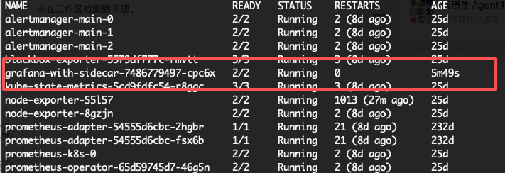

# Infrastructure as Code - Terraform Project

[](https://www.terraform.io/)
[](https://aws.amazon.com/eks/)
[](.github/workflows/)

##  Overview

This repository contains Infrastructure as Code (IaC) configurations for deploying and managing AWS infrastructure using Terraform. It includes comprehensive CI/CD pipelines, multi-environment support, EKS Kubernetes clusters, and automated infrastructure management.

##  Architecture

### Infrastructure Components

- **VPC** - Multi-AZ network topology with public/private subnets
- **EKS** - Managed Kubernetes clusters for container orchestration
- **RDS Aurora** - High-availability MySQL/PostgreSQL database clusters
- **NAT Gateways** - High availability internet access for private subnets
- **Security Groups** - Network security and access control
- **IAM Roles** - Service-linked roles for EKS, RDS and related services

### Environments

| Environment | Purpose | CIDR Range | EKS Config | Auto-Apply |
|------------|---------|------------|------------|------------|
| Dev | Development & testing | 10.0.0.0/16 | t3.medium, 1-3 nodes | ✅ Yes |
| Test | Integration testing | 10.1.0.0/16 | t3.medium, 1-3 nodes | ❌ Manual approval |
| Staging | QA & integration testing | 10.2.0.0/16 | t3.medium, 2-5 nodes | ❌ Manual approval |
| Perf | Performance testing | 10.3.0.0/16 | t3.large, 2-10 nodes | ❌ Manual approval |
| Prod | Production workloads | 10.4.0.0/16 | t3.large, 3-15 nodes | ❌ Strict approval |

##  CI/CD Pipeline

Automated infrastructure deployment using GitHub Actions:

### Workflows

- **PR Validation** - Format check, validation, security scanning, plan generation
- **Deployment** - Multi-environment deployment with manual approval gates
- **Drift Detection** - Daily automated configuration drift monitoring
- **Controlled Destruction** - Safe infrastructure teardown with strict confirmation

### Features

✅ Automated validation on every PR  
✅ Security scanning with tfsec  
✅ Multi-environment isolation  
✅ OIDC authentication (no long-lived credentials)  
✅ Slack notifications  
✅ Infrastructure drift detection  
✅ Comprehensive audit logging  

 **[CI/CD Documentation](.github/workflows/README.md)**

##  Project Structure

```
.
├── .github/
│   ├── CODEOWNERS                    # Code review assignments
│   └── workflows/
│       ├── k8s-ci.yml               # CI workflow
│       ├── k8s-deploy.yml           # Deployment workflow 
│       ├── terraform-pr.yml         # PR validation workflow
│       ├── terraform-apply.yml      # Deployment workflow
│       ├── terraform-destroy.yml    # Destruction workflow
│       └── terraform-drift-detect.yml # Drift detection
│
├── docs/
│   ├── eks-design.md                # EKS architecture design
│   ├── eks-deployment-guide.md      # EKS deployment guide
│   ├── terraform_cicd_design.md     # CI/CD architecture design
│   ├── terraform_cicd_setup.md      # Complete setup guide
│   ├── terraform_cicd_quick_reference.md # Quick reference
│   ├── iam_policy_templates.md      # IAM policy examples
│   └── ...                          # Additional documentation
│
├── tf/
│   ├── main.tf                      # Main Terraform configuration
│   ├── vpc.tf                       # VPC and networking
│   ├── eks.tf                       # EKS cluster configuration
│   ├── rds.tf                       # RDS Aurora database configuration
│   ├── variables.tf                 # Input variables
│   ├── outputs.tf                   # Output values
│   ├── modules/                     # Reusable modules
│   │   ├── eks/                     # EKS module
│   │   │   ├── main.tf             # EKS cluster & node groups
│   │   │   ├── variables.tf        # EKS input variables
│   │   │   ├── outputs.tf          # EKS output values
│   │   │   └── README.md           # Module documentation
│   │   └── rds/                    # RDS Aurora module
│   │       ├── main.tf             # RDS Aurora cluster configuration
│   │       ├── variables.tf        # RDS input variables
│   │       ├── outputs.tf          # RDS output values
│   │       └── README.md           # Module documentation
│   └── envs/                       # Environment-specific variables
│       ├── terraform_dev.tfvars
│       ├── terraform_test.tfvars
│       ├── terraform_staging.tfvars
│       ├── terraform_perf.tfvars
│       └── terraform_prod.tfvars
├── manifest                         # Kubernetes manifests
│   ├── base                         # Base manifests
│   │   ├── aws-load-balancer-controller # AWS ALB controller
│   │   │   └── kustomization.yaml
│   │   ├── cert-manager             # Cert-manager
│   │   │   └── kustomization.yaml
│   │   ├── demo-project             # Demo project
│   │   │   ├── configmap.yaml
│   │   │   ├── deployment.yaml
│   │   │   ├── ingress.yaml
│   │   │   ├── kustomization.yaml
│   │   │   ├── rbac.yaml
│   │   │   ├── secret.yaml
│   │   │   └── service.yaml
│   │   └── kustomization.yaml
│   ├── dev                          # Development manifests
│   │   └── kustomization.yaml
│   ├── perf
│   │   └── kustomization.yaml
│   ├── prod
│   │   └── kustomization.yaml
│   ├── staging
│   │   └── kustomization.yaml
│   └── test
│       └── kustomization.yaml
└── .gitignore                       # Git ignore rules
```

##  Getting Started

### Prerequisites

- Terraform >= 1.15.0
- AWS Provider >= 6.0.0
- AWS CLI configured
- kubectl (for EKS management)
- GitHub repository with appropriate permissions
- AWS account with IAM access

### Quick Start

1. **Clone the repository**
   ```bash
   git clone <repository-url>
   cd demo-project
   ```

2. **Configure AWS credentials**
   ```bash
   aws configure
   ```

3. **Initialize Terraform**
   ```bash
   cd tf
   terraform init
   ```

4. **Plan infrastructure**
   ```bash
   terraform plan -var-file="envs/terraform_dev.tfvars"
   ```

5. **Apply infrastructure**
   ```bash
   terraform apply -var-file="envs/terraform_dev.tfvars"
   ```

6. **Configure kubectl for EKS**
   ```bash
   aws eks update-kubeconfig --region us-east-1 --name demo-project-dev-eks
   kubectl get nodes
   ```

### CI/CD Setup

For complete CI/CD pipeline setup, see:
- [Setup Guide](docs/terraform_cicd_setup.md)
- [Quick Reference](docs/terraform_cicd_quick_reference.md)

##  Documentation

### EKS Documentation

- **[EKS Design](docs/eks-design.md)** - EKS architecture and design decisions
- **[EKS Deployment Guide](docs/eks-deployment-guide.md)** - Complete EKS deployment instructions
- **[EKS Implementation Summary](docs/eks-implementation-summary.md)** - EKS implementation overview

### RDS Aurora Documentation

- **[RDS Quick Start](docs/rds_quickstart.md)** - Complete guide for deploying RDS Aurora clusters
- **[RDS Module Docs](tf/modules/rds/README.md)** - RDS module usage and configuration reference

### Core Documentation

- **[Design Document](docs/terraform_cicd_design.md)** - CI/CD architecture and design decisions
- **[Setup Guide](docs/terraform_cicd_setup.md)** - Complete CI/CD configuration instructions
- **[Quick Reference](docs/terraform_cicd_quick_reference.md)** - Common commands and troubleshooting
- **[IAM Templates](docs/iam_policy_templates.md)** - AWS IAM policy examples

### Infrastructure Documentation

- **[Environment Config](docs/environment_config.md)** - Environment-specific settings
- **[Network Topology](docs/network_topology.md)** - VPC and subnet design


##  Security

### Best Practices Implemented

- **OIDC Authentication** - No long-lived AWS credentials in CI/CD
- **Least Privilege** - Environment-specific IAM roles with minimal permissions
- **State Encryption** - S3 backend with server-side encryption
- **State Locking** - DynamoDB-based locking to prevent concurrent modifications
- **Branch Protection** - Required reviews and status checks
- **Code Ownership** - Automatic reviewer assignment via CODEOWNERS
- **Security Scanning** - Automated tfsec scans on every PR
- **Audit Logging** - Comprehensive workflow execution logs

### EKS Security

- **Private Endpoints** - EKS API endpoints restricted to private network
- **Subnet Tagging** - Proper Kubernetes tags for load balancer discovery
- **Node Group IAM** - Least privilege IAM policies for worker nodes
- **Security Groups** - Restricted network access to cluster API
- **CloudWatch Logging** - Comprehensive cluster audit logging
- **Encryption at Rest** - etcd encryption enabled by default

### RDS Aurora Security

- **Storage Encryption** - AES-256 encryption at rest (enabled by default)
- **Private Subnets** - Database instances deployed in private subnets only
- **Security Groups** - Controlled access from specific CIDR ranges or security groups
- **Enhanced Monitoring** - OS-level metrics with configurable intervals
- **Performance Insights** - Database performance analysis and query optimization
- **Automated Backups** - Point-in-time recovery with configurable retention
- **Multi-AZ Deployment** - High availability with automatic failover

### Compliance

- Infrastructure drift detection and reporting
- Version-controlled infrastructure changes
- Manual approval gates for production
- Immutable infrastructure patterns

##  Contributing

### Workflow

1. Create feature branch from `main`
2. Make infrastructure changes
3. Open Pull Request
4. Review automated plan output
5. Address security findings
6. Get required approvals
7. Merge to trigger deployment

### Code Review Requirements

- **Dev/Staging**: 1 approval
- **Production**: 2 approvals
- **Code Owners**: Automatic review assignment
- **Status Checks**: All CI/CD checks must pass

##  Troubleshooting

Common issues and solutions:

- **OIDC Authentication Failures** - Verify IAM role trust policy
- **Terraform Init Errors** - Check backend configuration
- **Permission Denied** - Review IAM policies
- **State Lock Conflicts** - Check for stuck workflows
- **EKS Node Join Issues** - Verify subnet tags and security groups
- **kubectl Connection Issues** - Update kubeconfig with AWS CLI
- **RDS Connection Issues** - Check security groups, subnet routing, and credentials
- **RDS Performance Issues** - Review Performance Insights and CloudWatch metrics

See [Quick Reference](docs/terraform_cicd_quick_reference.md#troubleshooting) for detailed troubleshooting steps.
See [RDS Quick Start](docs/rds_quickstart.md#troubleshooting) for RDS-specific troubleshooting.

##  Support

- **Documentation**: `/docs` directory
- **Workflow Logs**: GitHub Actions tab
- **Issues**: Create with labels `ci-cd`, `terraform`, `infrastructure`, `eks`
- **Teams**: @infrastructure-team, @devops-team, @terraform-admins


##  Related Projects

- [Terraform AWS Provider](https://registry.terraform.io/providers/hashicorp/aws/latest/docs)
- [GitHub Actions](https://docs.github.com/en/actions)
- [AWS EKS Best Practices](https://aws.github.io/aws-eks-best-practices/)
- [Infrastructure as Code Security](https://owasp.org/www-project-top-10-ci-cd-security-risks/)

---

## Application for this project

- [Deployment Status](https://github.com/aws-samples/terraform-ci-cd-for-eks/actions/workflows/deploy.yml) Just demonstrate how to deploy application to EKS does not mean that application is deployed.
- Application repo [https://github.com/fdiskbrain/k8s-sidecar](https://github.com/fdiskbrain/k8s-sidecar),full source code can be found there.
- Develop pipeline for application can be found at [https://github.com/fdiskbrain/k8s-sidecar/blob/main/.gitlab-ci.yml](https://github.com/fdiskbrain/k8s-sidecar/blob/main/.gitlab-ci.yml)
- Application docker image can be found at [https://github.com/fdiskbrain/k8s-sidecar/pkgs/container/k8s-sidecar](https://github.com/fdiskbrain/k8s-sidecar/pkgs/container/k8s-sidecar)


## Enhancements  this project can do
- [ ] Add CI/CD for application autotest
- [ ] docker image for application can be scanned by ecr scan
- [ ] security scan for application runtime
